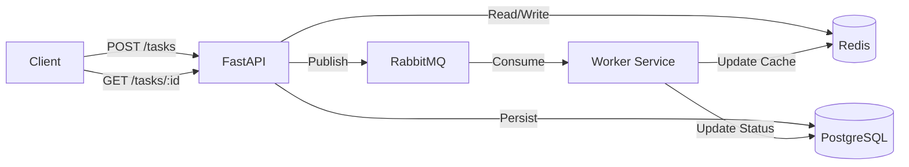

# Scalable Task Processing Backend

A production-style asynchronous task processing system built with FastAPI, PostgreSQL, Redis, RabbitMQ, and Docker.

## 🚀 Features

- **Async Task Submission**: Submit long-running tasks via REST API.
- **Message Queue**: Tasks are pushed to RabbitMQ for decoupled processing.
- **Background Worker**: Dedicated worker service consumes tasks and simulates processing.
- **Redis Caching**: Task status is cached in Redis for fast retrieval (Read-through/Write-through).
- **PostgreSQL Persistence**: All tasks and results are stored in a relational database.
- **Dockerized**: Full system orchestration with Docker Compose.

## 🏗️ Architecture



## 🛠️ Tech Stack

- **Python 3.10**
- **FastAPI** (API Framework)
- **PostgreSQL** (Database)
- **Redis** (Cache)
- **RabbitMQ** (Message Broker)
- **Docker & Docker Compose**

## 📦 Setup & Running

### Prerequisites
- Docker & Docker Compose

### 1. Start the System
```bash
docker compose up -d --build
```

### 2. Access API
- **Swagger UI**: [http://localhost:8002/docs](http://localhost:8002/docs)
- **API Root**: [http://localhost:8002](http://localhost:8002)

### 3. Verify System
Run the included verification script:
```bash
# Install dependencies locally if needed (httpx)
pip install httpx

# Run verification
python verify_phase4.py
```
Note: The verification script assumes the API is running on port **8005** (mapped in docker-compose).

## 🧪 API Endpoints

### `POST /tasks/`
Create a new task.
- **Response**: `{"id": 1, "status": "PENDING", "result": null}`

### `GET /tasks/{id}`
Get task status.
- **Response**: `{"id": 1, "status": "COMPLETED", "result": "Computed!"}`

## 🔧 Configuration

Environment variables are set in `docker-compose.yml`:
- `DATABASE_URL`: Connection string for PostgreSQL.
- `REDIS_HOST`, `REDIS_PORT`: Redis configuration.
- `RABBITMQ_URL`: RabbitMQ connection string.

## 🔍 Implementation Details

- **Robust Connections**: API and Worker include retry logic to handle container startup race conditions.
- **Shared Codebase**: API and Worker share `app/` models and logic, ensuring consistency.
